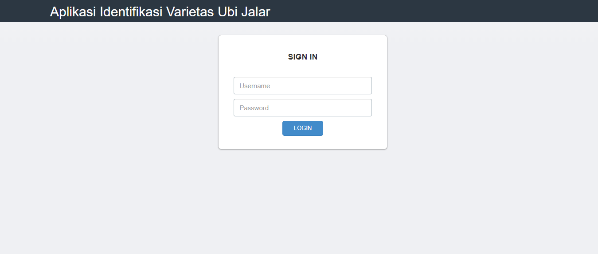
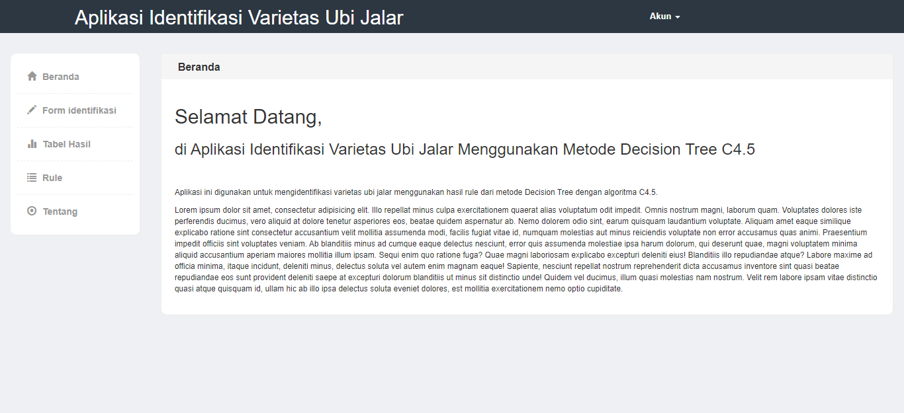
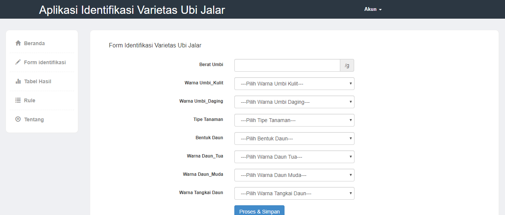
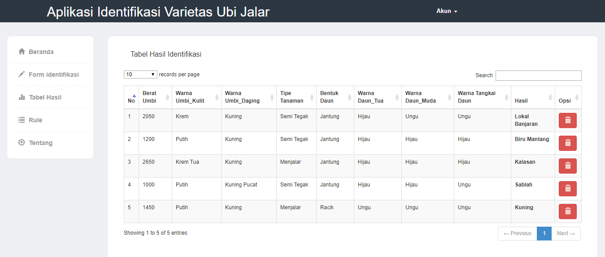

# SPK Penentuan Identifikasi Varietas Ubi Jalar

Sistem Pendukung Keputusan (SPK) Penentuan Identifikasi Varietas Ubi Jalar merupakan tugas project untuk memenuhi persyaratan kelulusan pada mata kuliah Kecerdasan Buatan. Sistem ini dibangun dengan metode Decision Tree Algoritma C4.5.

## Screenshot
<pre>
           
</pre>

## Fitur Sistem
* [x] Fitur login.
* [x] Form untuk mengidentifikasi ciri ubi jalar.
* [x] Melihat dan menyimpan hasil identifikasi ke dalam database mysql.

## Demo
Link website : coming soon.  
Untuk database bisa membelinya dengan hubungi :  
https://t.me/triagung128 atau triagung128@gmail.com.

## Author
**Tri Agung Susilo**  
Dont for get to follow and ★ star

